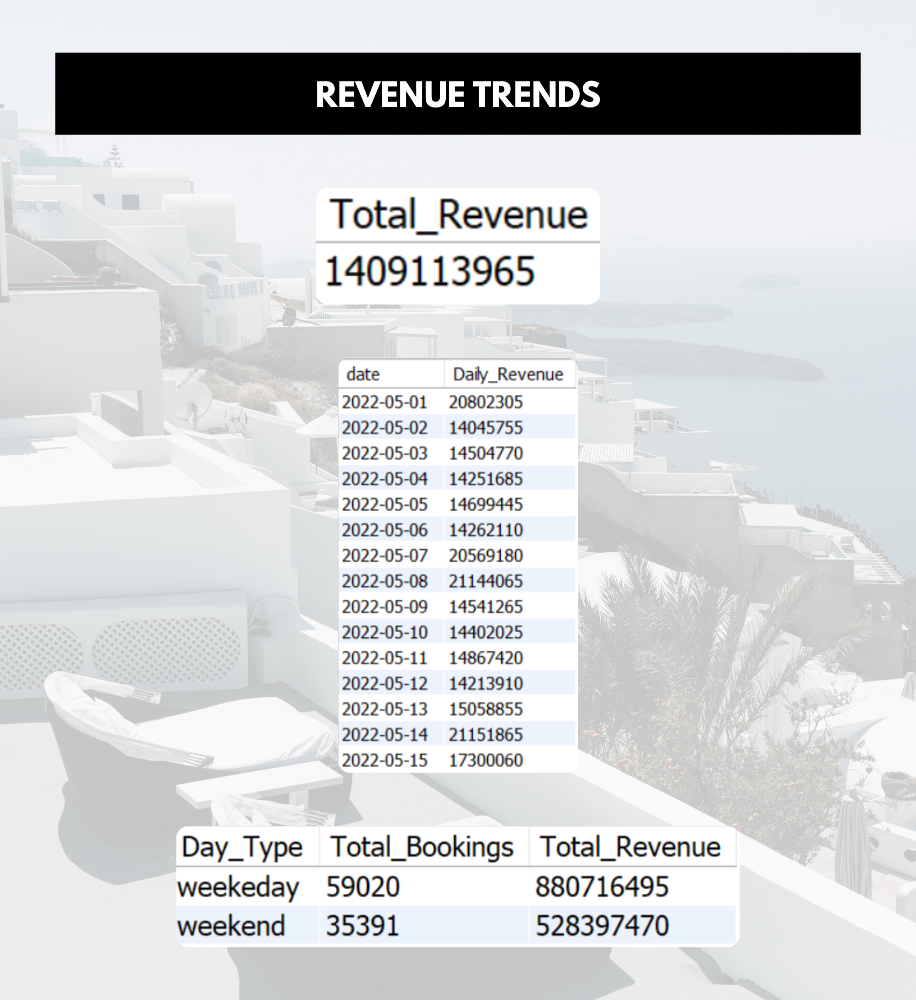
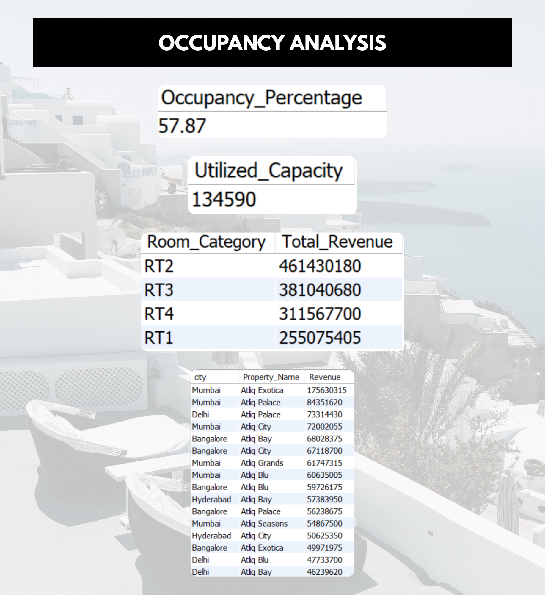

# 🏨 Hotel Performance Analysis using SQL

📊 Hotel Performance Analysis – Revenue, Occupancy & Booking Insights (SQL)

This repository contains a SQL-based analysis of hotel booking data focused on understanding revenue performance, occupancy utilization, cancellations, and booking trends through business-driven SQL queries.

## 🎯 Project Objectives
- Analyze total bookings and booking status distribution  
- Evaluate total revenue and occupancy percentage  
- Measure the impact of cancellations and no-shows  
- Identify daily and weekly booking & revenue trends  
- Compare weekday vs weekend booking behavior  
- Highlight top-performing cities, properties, and room categories  

## 🛠 Tools & Technologies
- MySQL  
- SQL Joins & Aggregations  
- CASE Statements  
- Date-based Analysis  

## Analysis Preview

### 1️⃣ Booking & Revenue Overview

This analysis focuses on total bookings, booking status distribution, cancellation rate, and overall revenue performance.

### 2️⃣ Time-Based Trends

This section highlights daily and weekly trends in bookings, revenue, and occupancy.

### 3️⃣ Occupancy & Property Performance

This analysis evaluates occupancy percentage, utilized capacity, and performance across cities, properties, and room categories.

## 📈 Key Insights
- Revenue is primarily driven by successfully checked-out bookings  
- Cancellations and no-shows result in revenue leakage  
- Overall occupancy remains below full capacity  
- Weekend bookings generate higher revenue than weekdays  
- Revenue is concentrated across specific cities and properties  
- Certain room categories consistently outperform others  

## 👥 Intended Audience
- Data Analysts and Business Analysts  
- Students learning SQL for business analysis  
- Recruiters reviewing SQL case studies  

## 🔗 Project Resources
[SQL Insights PDF](Hotel%20Performance%20Analysis.pdf)

## ✍️ Author
**Neha Rane**
